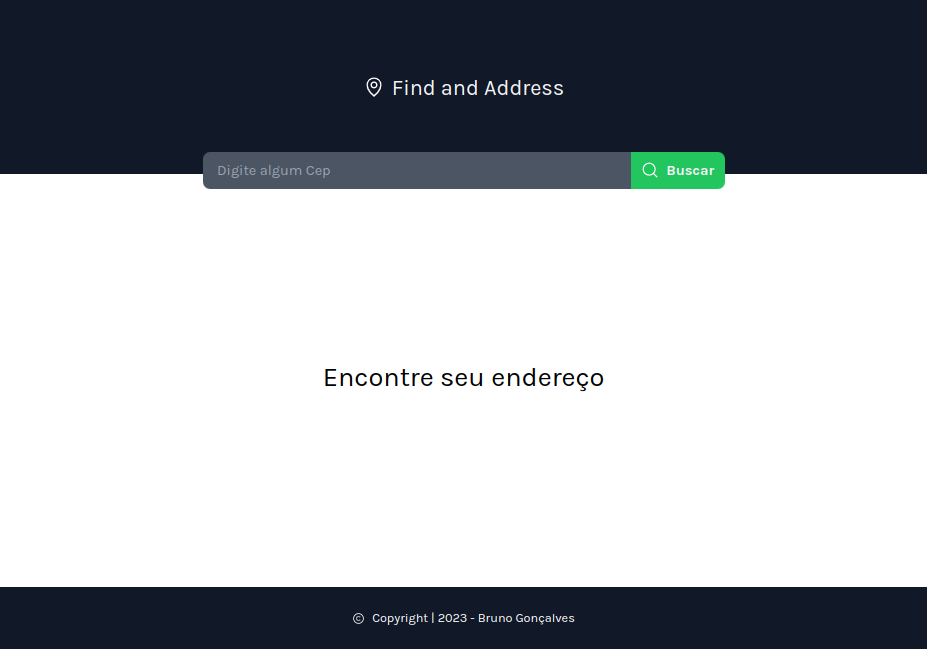
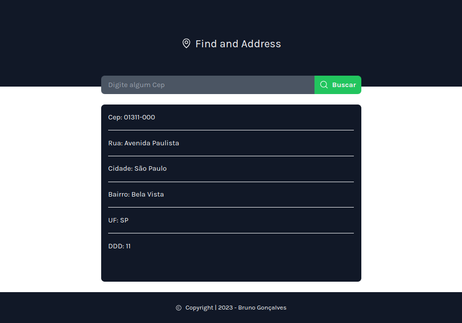

<h1 align="center">find address</h1>

  <a href="#layout">Layout</a> |
  <a href="#projeto">Projeto</a> |
  <a href="#funcionalidades">Funcionalidades</a> |
  <a href="#tecnologias">Tecnologias</a> |
  <a href="#autor">Autor</a>

 

# Layout

  
   
   
  

 

# Projeto

Aplicação em ReactJS, onde conseguimos buscar dados do endereço via número do Cep.

Com os fundamentos em ReactJS, de componentes, imutabilidade, propriedades, renderização condicional foi fundamental para a construção da aplicação.

 

# Funcionalidades

- [x] Inserir número do Cep
       
      Recebemos:
  - [x] Nome da rua
  - [x] Nome da cidade
  - [x] Nome do Bairro
  - [x] Número do DDD
  - [x] UF referente ao estado

 

# Tecnologias

Abaixo as tecnologias usadas no projeto

- REACTJS
- HTML
- JavaScript
- Phosphor Icons
- API <a href="https://viacep.com.br/">viacep</a>

 

# Autor

 
Bruno Gonçalves Ferreira
 
 

 

